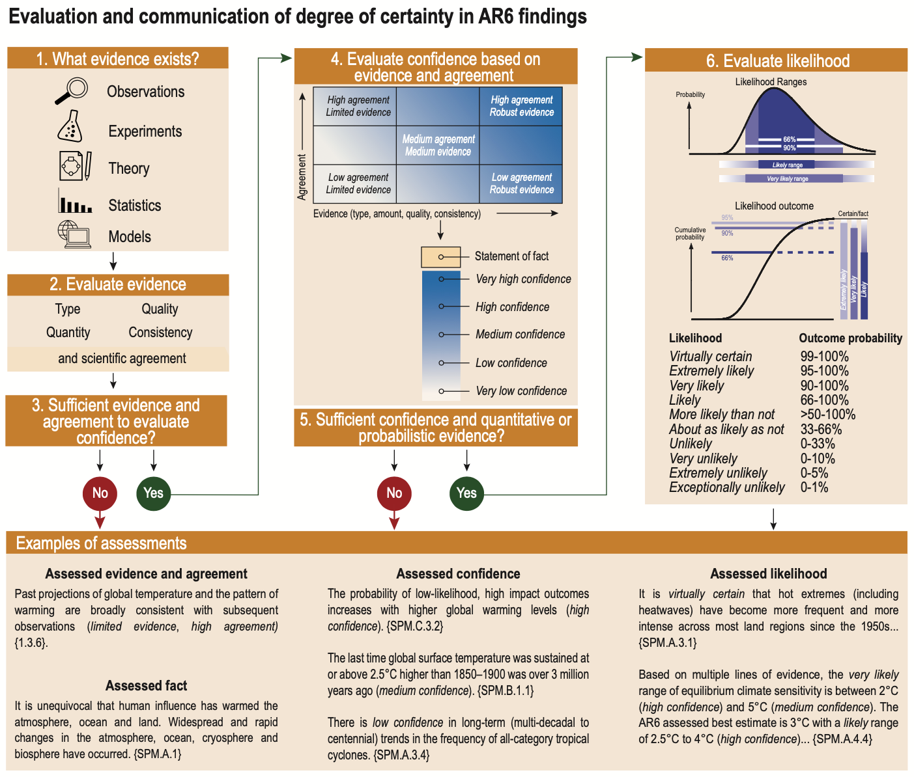

# ClimateX Expert Confidence in Climate Statements Dataset
_What do LLMs know about climate? Let's find out!_

This repository contains the code and experimental results for the [ClimateX: Do LLMs Accurately Assess Human Expert Confidence in Climate Statements?](https://arxiv.org/abs/2311.17107) paper presented at the Tackling Climate Change with Machine Learning workshop at NeurIPS 2023.

### ClimateX Dataset

We introduce the **ClimateX (Expert Confidence in Climate Statements) dataset**, a novel, curated, expert-labeled, natural language dataset of 8094 statements extracted or paraphrased from the three latest IPCC reports, along with their associated confidence levels (low, medium, high, or very high) as assessed by IPCC climate scientists based on the quantity and quality of available evidence and agreement among their peers. 

The ClimateX dataset is [available for download on HuggingFace](https://huggingface.co/datasets/rlacombe/ClimateECCS).

### IPCC Confidence Labels

The authors of the United Nations International Panel on Climate Change (IPCC) reports have developed a structured framework to communicate the confidence and uncertainty levels of statements regarding our knowledge of climate change ([Mastrandrea, 2010](https://link.springer.com/article/10.1007/s10584-011-0178-6)). 

Our dataset leverages this distinctive and consistent approach to labelling uncertainty across topics, disciplines, and report chapters, to help NLP and climate communication researchers evaluate how well LLMs can assess human expert confidence in a set of climate science statements from the IPCC reports.



Source: [IPCC AR6 Working Group I report](https://www.ipcc.ch/report/ar6/wg1/)

### Dataset Construction

The **ClimateX (Expert Confidence in Climate Statements) dataset** is a novel, curated, expert-labeled, natural language dataset of 8094 statements extracted or paraphrased from the IPCC Assessment Report 6: [Working Group I report](https://www.ipcc.ch/report/ar6/wg1/), [Working Group II report](https://www.ipcc.ch/report/ar6/wg2/), and [Working Group III report](https://www.ipcc.ch/report/ar6/wg3/), respectively. 

Each statement is labeled with the corresponding IPCC report source, the page number in the report PDF, and the corresponding confidence level on the 5-level confidence scale as assessed by IPCC climate scientists based on available evidence and agreement among their peers. 

To construct the dataset, we retrieved the complete raw text from each of the three IPCC report PDFs that are available online using an open-source library [pypdf2](https://pypi.org/project/PyPDF2/). We then normalized the whitespace, tokenized the text into sentences using [NLTK](https://www.nltk.org/) , and used regex search to filter for complete sentences including a parenthetical confidence label at the end of the statement, of the form _sentence (low|medium|high|very high confidence)_. The final ClimateECCS dataset contains 8094 labeled sentences. 

From the full 8094 labeled sentences, we further selected **300 statements to form a smaller and more tractable test dataset**. We performed a random selection of sentences within each report and confidence category, with the following objectives:
- Making the test set distribution representative of the confidence class distribution in the overall train set and within each report;
- Making the breakdown between source reports representative of the number of statements from each report;
- Making sure the test set contains at least 5 sentences from each class and from each source, to ensure our results are statistically robust. 

Then, we manually reviewed and cleaned each sentence in the test set to provide for a fairer assessment of model capacity. 
- We removed 26 extraneous references to figures, call-outs, boxes, footnotes, or subscript typos (`CO 2');
- We split 19 compound statements with conflicting confidence sub-labels, and removed 6 extraneous mid-sentence labels of the same category as the end-of-sentence label;
- We added light context to 23 sentences, and replaced 5 sentences by others when they were meaningless outside of a longer paragraph;
- We removed qualifiers at the beginning of 29 sentences to avoid biasing classification (e.g. 'But...', 'In summary...', 'However...').

**The remaining 7794 sentences not allocated to the test split form our train split.**

Of note: while the IPCC report uses a 5 levels scale for confidence, almost no `very low confidence` statement makes it through the peer review process to the final reports, such that no statement of the form _sentence (very low confidence)_ was retrievable. Therefore, we chose to build our data set with only statements labeled as `low`, `medium`, `high` and `very high` confidence.

### Paper ### 

We use this dataset to evaluate how recent LLMs fare at classifying the  scientific confidence associated with each statement in a statistically representative, carefully constructed test split of the dataset. 

We show that `gpt3.5-turbo` and `gpt4` assess the correct confidence level with reasonable accuracy even in the zero-shot setting; but that, along with other language models we tested, they consistently overstate the certainty level associated with low and medium confidence labels. Models generally perform better on reports before their knowledge cutoff, and demonstrate intuitive classifications on a baseline of non-climate statements. However, we caution it is still not fully clear why these models perform well, and whether they may also pick up on linguistic cues within the climate statements and not just prior exposure to climate knowledge and/or IPCC reports.

Our results have implications for climate communications and the use of generative language models in knowledge retrieval systems. We hope the ClimateX dataset provides the NLP and climate sciences communities with a valuable tool with which to evaluate and improve model performance in this critical domain of human knowledge. 

Pre-print upcomping.

### Experiments Code

This repository contains dataset collection and analysis code, as well as our zero-shot and few-shots experiments on the ClimateX dataset, using the [DSP library](https://github.com/stanfordnlp/dsp). We also release raw output from our scraper script to construct the raw train and test sets before light curation, for reproductibility purposes, as well a random baseline dataset of 337 sentences created as a robustness check. 

```
├─ README.MD -> this document
│
├─ dsp_zeroshot_experiments.ipynb -> notebook to reproduce zero-shot experiments
├─ dsp_fewshots_experiments.ipynb -> notebook to reproduce few-shots experiments
├─ gemini_pro_zeroshot_experiments.ipynb -> notebook to reproduce Gemini Pro zero-shot experiments
├─ gemini_pro_fewshots_experiments.ipynb -> notebook to reproduce Gemini Pro few-shots experiments
├─ bert_classifier.py -> script to train and evaluate a BERT classifier baseline
├─ bert_classifier.ipynb -> notebook to run the BERT classifier baseline script
├─ random_baseline_experiments.ipynb -> notebook to reproduce random baseline experiments
├─ pdf_scraper.ipynb -> notebook to reproduce the dataset from the IPCC reports
│
├─ data/ -> ClimateECCS dataset
│    └─ ipcc_statements_dataset.tsv -> ClimateECCS train and test sets
│    └─ random_baseline.csv -> random baseline dataset
│    └─ text_processing/ -> raw output of dataset collection notebook for reproduction purposes
│
├─ human eval/ -> baseline human evaluation
│    └─ human_eval_testset.tsv -> raw output from human eval
│    └─ human_nonexpert_confidence.ipynb -> data analysis
│
├─ results/ -> experimental results
│    └─ iccs_zeroshot -> raw model output from zero-shot experiments
│    └─ iccs_fewshots -> raw model output from zero-shot experiments
│    └─ iccs_zeroshot -> raw model output from zero-shot experiments

```

### Citation

If you found this dataset, code, or paper useful, please cite as follows:

```
@misc{lacombe2023climatex,
      title={ClimateX: Do LLMs Accurately Assess Human Expert Confidence in Climate Statements?}, 
      author={Romain Lacombe and Kerrie Wu and Eddie Dilworth},
      year={2023},
      eprint={2311.17107},
      archivePrefix={arXiv},
      primaryClass={cs.LG}
}
```
